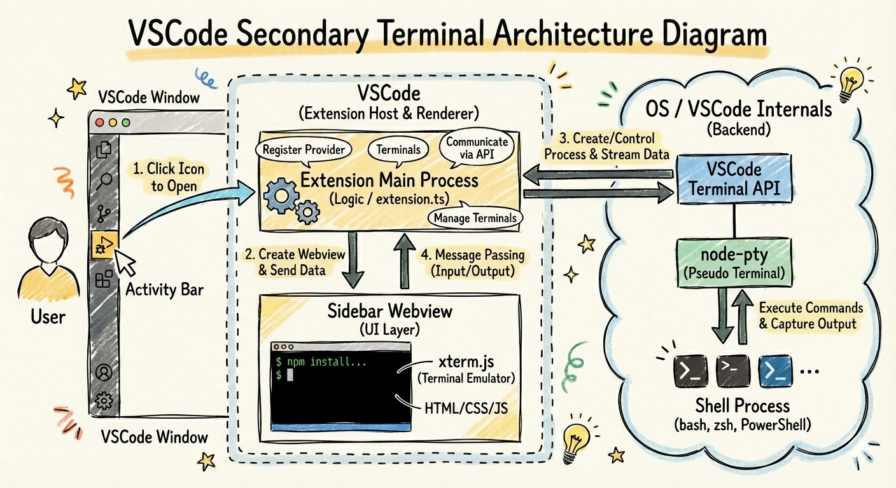

# Secondary Terminal - VS Code Extension

[](https://deepwiki.com/s-hiraoku/vscode-sidebar-terminal)

[](https://marketplace.visualstudio.com/items?itemName=s-hiraoku.vscode-sidebar-terminal)
[](https://marketplace.visualstudio.com/items?itemName=s-hiraoku.vscode-sidebar-terminal)
[](https://marketplace.visualstudio.com/items?itemName=s-hiraoku.vscode-sidebar-terminal)
[](https://github.com/s-hiraoku/vscode-sidebar-terminal/blob/main/LICENSE)

**The Essential Tool for the CLI Coding Agent Era** - A production-ready terminal extension for developers who need more than VS Code's standard terminal. Manage up to 5 terminals in the sidebar with seamless AI agent integration for Claude Code, Codex CLI, Gemini CLI, and GitHub Copilot.

> **Note**: This extension is under active development. Please expect some bugs as we continuously improve the experience.


## Quick Start

### Installation

1. **VS Code Marketplace**: Search "Secondary Terminal" in Extensions
2. **Command Line**: `code --install-extension s-hiraoku.vscode-sidebar-terminal`
3. **Manual**: Download VSIX from [releases](https://github.com/s-hiraoku/vscode-sidebar-terminal/releases)

### First Use

1. Click the terminal icon (ST) in the activity bar
2. A terminal opens automatically with your default shell
3. Run your AI agent: `claude`, `codex`, `gemini`, or `gh copilot`
4. Look for **"AI Agent Connected"** status in the terminal header

## Key Features

### Terminal Management

| Feature                 | Description                                                |
| ----------------------- | ---------------------------------------------------------- |
| **Multiple Terminals**  | Up to 5 concurrent terminal instances                      |
| **Session Persistence** | Auto-save/restore sessions with 1,000 lines scrollback     |
| **Split Views**         | Vertical/horizontal splitting for multi-terminal workflows |
| **Tab Management**      | Drag & drop reordering, close buttons, smart switching     |
| **Cross-Platform**      | Windows, macOS, and Linux support                          |

### AI Agent Integration

Automatic detection and status tracking for:

- **Claude Code** - `claude "your task"`
- **Codex CLI** - `codex "your task"`
- **Gemini CLI** - `gemini "your task"`
- **GitHub Copilot** - `gh copilot` or keyboard shortcut

**Features:**

- Real-time connection status indicators
- File reference sharing with `Cmd+Alt+L` (Mac) / `Ctrl+Alt+L` (Win/Linux)
- Session persistence across VS Code restarts
- Multi-agent workflows across terminals

### Developer Experience

- **Full Clipboard Support** - Standard Ctrl/Cmd+C/V shortcuts
- **IME Support** - Japanese, Chinese, Korean input methods
- **Link Handling** - Click file paths to open in VS Code, URLs open in browser
- **Alt+Click Positioning** - VS Code-standard cursor placement
- **Debug Panel** - Real-time monitoring with `Ctrl+Shift+D`

## Keyboard Shortcuts

| Shortcut                      | Action                                                                 |
| ----------------------------- | ---------------------------------------------------------------------- |
| `Cmd+Alt+L` / `Ctrl+Alt+L`    | Insert file reference for AI agents (from editor)                       |
| `Cmd+K Cmd+C` / `Ctrl+K Ctrl+C` | Activate GitHub Copilot Chat                                            |
| ``Ctrl+` ``                   | Focus Secondary Terminal view (when terminal is not focused)            |
| ``Ctrl+Shift+` ``             | Create new terminal                                                     |
| `Cmd+\\` (Mac) / `Ctrl+Shift+5` | Split terminal vertically (when Secondary Terminal is focused)          |
| `Cmd+K` / `Ctrl+K`            | Clear terminal (when Secondary Terminal is focused)                     |
| `Alt+Cmd+Left/Right` (Mac) / `Alt+Left/Right` | Focus previous/next terminal (when focused)                |
| `Cmd+Alt+1..5` (Mac) / `Alt+1..5` | Focus terminal by index (when focused)                                 |
| `Ctrl+Shift+D`                | Toggle debug panel (webview)                                            |

Other UX features:
- `Alt+Click` moves the cursor (VS Code-style) when enabled.

## Command Palette

Access via `Ctrl+Shift+P` (Win/Linux) or `Cmd+Shift+P` (Mac):

| Command                                         | Description          |
| ----------------------------------------------- | -------------------- |
| `Secondary Terminal: Focus Terminal`            | Focus terminal panel |
| `Secondary Terminal: Create New Terminal`       | Create a new terminal |
| `Secondary Terminal: Split Terminal Vertically` | Split vertically     |
| `Secondary Terminal: Split Terminal Horizontally` | Split horizontally |
| `Secondary Terminal: Select Terminal Profile`   | Choose a profile     |
| `Secondary Terminal: Manage Terminal Profiles`  | Edit profiles        |
| `Secondary Terminal: Show Version`              | Display version info |
| `Secondary Terminal: Clear Corrupted Terminal History` | Clear session data |

## Configuration

### Basic Settings

```json
{
  "secondaryTerminal.shell": "auto",
  "secondaryTerminal.maxTerminals": 5,
  "secondaryTerminal.fontSize": 14,
  "secondaryTerminal.fontFamily": "MesloLGS NF, Monaco, monospace",
  "secondaryTerminal.cursorBlink": true
}
```

### AI Agent Settings

```json
{
  "secondaryTerminal.enableCliAgentIntegration": true,
  "secondaryTerminal.enableGitHubCopilotIntegration": true,
  "secondaryTerminal.focusAfterAtMention": true
}
```

## Architecture



**Extension Host (Node.js)**

- TerminalManager: PTY processes, lifecycle, AI detection
- Session Management: Persistent state across restarts

**WebView (Browser)**

- xterm.js: Terminal emulation
- Manager System: Input, UI, Performance, Splitting, Configuration

## Performance

- **Build Size**: ~790 KiB extension + ~1.5 MiB webview
- **Rendering**: WebGL with auto DOM fallback
- **Output Buffering**: Adaptive 2-16ms intervals (up to 250fps for AI output)
- **Memory**: Efficient cleanup with LIFO disposal pattern
- **Scrollback**: <1s restore for 1,000 lines with ANSI color preservation

## Troubleshooting

### Terminal Not Starting

- Check `secondaryTerminal.shell` setting points to valid shell
- Verify shell is accessible from your PATH

### AI Agent Not Detected

- Ensure `secondaryTerminal.enableCliAgentIntegration` is `true`
- Check debug panel (`Ctrl+Shift+D`) for detection logs
- Verify agent is properly installed

### Performance Issues

- Reduce `secondaryTerminal.maxTerminals` if needed
- Check system resources via debug panel

## Development

```bash
# Build
npm install
npm run compile

# Test
npm test              # Unit tests
npm run test:e2e      # E2E tests (Playwright)

# Development
npm run watch         # Watch mode
npm run lint          # ESLint check
```

**Quality Standards:**

- TypeScript strict mode
- 275+ unit tests
- E2E test coverage with Playwright

## Known Limitations

- **Running Processes**: Long-running processes terminate on VS Code restart (scrollback preserved). Use `tmux`/`screen` for process persistence.
- **Active Development**: Some features may have rough edges

## Privacy

This extension respects VS Code's telemetry settings. We collect only anonymous usage metrics (feature usage, error rates) - never terminal content, file paths, or personal data.

To disable: Set `telemetry.telemetryLevel` to `"off"` in VS Code settings.

See [PRIVACY.md](PRIVACY.md) for details.

## Contributing

1. Fork the repository
2. Create feature branch: `git checkout -b feature/my-feature`
3. Follow TDD practices
4. Run quality checks: `npm run pre-release:check`
5. Submit pull request

See [GitHub Issues](https://github.com/s-hiraoku/vscode-sidebar-terminal/issues) for open tasks.

## Links

- [VS Code Marketplace](https://marketplace.visualstudio.com/items?itemName=s-hiraoku.vscode-sidebar-terminal)
- [GitHub Repository](https://github.com/s-hiraoku/vscode-sidebar-terminal)
- [Changelog](CHANGELOG.md)
- [Blog Article (Japanese)](https://zenn.dev/hiraoku/articles/0de654620028a0)

## License

MIT License - see [LICENSE](LICENSE) file.

---

**Built with ❤️ for VS Code developers working with AI agents**
