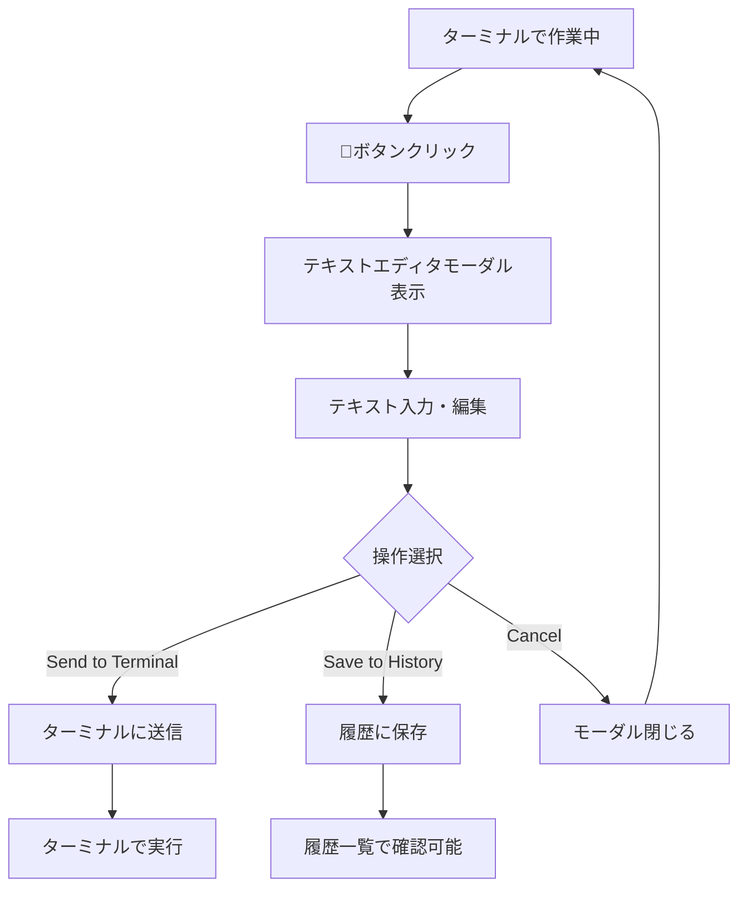
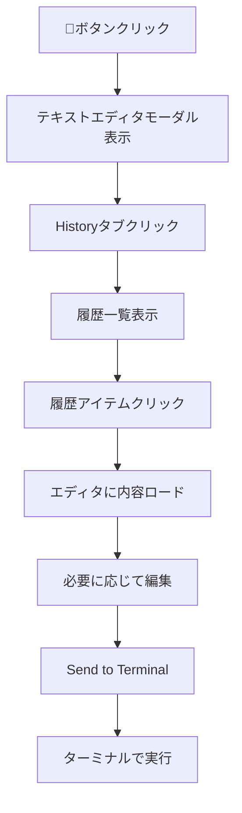

# Terminal Text Editor - User Experience Design

## ユーザージャーニー

### 基本フロー: テキスト作成・送信



### 履歴活用フロー



## インターフェース設計

### 1. ターミナルヘッダー統合

#### ボタン配置
```
[📁] [🔄] [📝] [⚙️] [✕]
 ^     ^     ^     ^    ^
Files Reload Text Settings Close
```

#### ボタン仕様
- **アイコン**: `📝` (codicon-edit)
- **位置**: リロードボタンの右、設定ボタンの左
- **サイズ**: 既存ボタンと統一（24×24px）
- **ツールチップ**: "Open Text Editor (Ctrl+Shift+E)"

### 2. テキストエディタモーダル

#### レイアウト構成
```
┌─ Terminal Text Editor ─────────────────────┐
│ [History] [New Text] [Settings]     [×]    │
├───────────────────────────────────────────┤
│                                           │
│  ┌─────────────────────────────────────┐  │
│  │ 1 | echo "Hello World"              │  │
│  │ 2 | cd /path/to/project            │  │  
│  │ 3 | npm start                      │  │
│  │ 4 |                               │  │
│  │   |                               │  │
│  └─────────────────────────────────────┘  │
│                                           │
├───────────────────────────────────────────┤
│ Lines: 3 | Chars: 45        [↗] [♡] [🗑] │
├───────────────────────────────────────────┤  
│      [Cancel] [Save to History] [Send]     │
└───────────────────────────────────────────┘
```

#### 機能要素詳細

**タブナビゲーション**
- `New Text`: 新規テキスト作成（デフォルト選択）
- `History`: 履歴一覧表示
- `Settings`: エディタ設定

**エディタエリア**  
- **行番号**: 左側に表示（設定で非表示可能）
- **シンタックスハイライト**: Shell/Bash構文対応
- **フォント**: VS Code Editor設定継承
- **テーマ**: VS Codeテーマ自動適用

**ステータスバー**
- **統計情報**: 行数、文字数
- **アクション**: 外部エディタで開く、お気に入り、削除

**コントロールボタン**
- `Cancel`: 変更破棄してモーダル閉じる
- `Save to History`: 履歴保存のみ（モーダル継続）
- `Send`: ターミナル送信してモーダル閉じる

### 3. 履歴管理インターフェース

#### 履歴一覧表示
```
┌─ Text History ─────────────────────────────┐
│ Search: [_____________] [🔍] Sort: [Date▼] │
├───────────────────────────────────────────┤
│ ♡ echo "Hello World"              2h ago  │
│ │  Simple greeting command               │  │
├───────────────────────────────────────────┤
│   npm install && npm start      1d ago   │
│ │  Development setup commands           │  │
├───────────────────────────────────────────┤
│   cd /project && git status     3d ago   │
│ │  Git workflow commands                │  │
├───────────────────────────────────────────┤
│                [Load More...]             │
└───────────────────────────────────────────┘
```

#### 履歴アイテム仕様
- **タイトル**: 最初の行（最大50文字、省略記号）
- **プレビュー**: 内容要約（最大100文字）  
- **メタデータ**: 相対日時、お気に入り状態
- **インタラクション**: 
  - クリック → エディタに読み込み
  - 右クリック → コンテキストメニュー（編集/削除/複製）

## キーボードショートカット

### グローバルショートカット
- `Ctrl+Shift+E` (Win/Linux) / `Cmd+Shift+E` (Mac): テキストエディタ開く

### モーダル内ショートカット  
- `Ctrl+Enter` / `Cmd+Enter`: Send to Terminal
- `Ctrl+S` / `Cmd+S`: Save to History
- `Escape`: Cancel/Close
- `Ctrl+F` / `Cmd+F`: 履歴内検索
- `Tab`: タブ切り替え
- `Ctrl+1,2,3`: タブ直接選択

## レスポンシブデザイン

### 画面サイズ対応

**大画面 (>800px幅)**
```  
┌─────────────────────────────────────────┐
│                Full UI                  │
│  ┌─────────────┬─────────────────────┐  │
│  │   History   │    Text Editor      │  │
│  │    List     │       Area         │  │
│  │             │                    │  │
│  └─────────────┴─────────────────────┘  │
└─────────────────────────────────────────┘
```

**中画面 (400-800px幅)**
```
┌─────────────────────┐
│    Tab Navigation   │  
├─────────────────────┤
│                     │
│   Active Content    │
│      (Single)       │
│                     │
└─────────────────────┘
```

**小画面 (<400px幅)**
```
┌─────────────┐
│  Compact UI │
├─────────────┤ 
│             │
│   Content   │
│             │
├─────────────┤
│ [Act] [Btn] │
└─────────────┘
```

## アクセシビリティ

### ARIA対応
- `role="dialog"` でモーダル定義
- `aria-labelledby` でモーダルタイトル参照
- `aria-describedby` で説明テキスト参照
- `tabindex` で適切なタブオーダー

### キーボードナビゲーション
- `Tab/Shift+Tab`: 要素間移動
- `Enter/Space`: ボタン・アイテム選択
- `Arrow keys`: リスト項目移動
- `Escape`: モーダル・メニュー閉じる

### スクリーンリーダー対応
- ボタン・リンクの適切な`aria-label`
- 状態変化のライブリージョン通知
- 進行状況のアナウンス

## パフォーマンス考慮

### 遅延ロード戦略
- 履歴データ: 20件ずつページング
- 仮想スクロール: 大量履歴への対応
- 検索結果: デバウンス処理（300ms）

### メモリ管理
- 未使用履歴データの自動開放
- テキストエディタの差分更新
- DOM要素の効率的な再利用

## エラーハンドリングUX

### エラー状態表示
```
┌─ Error State ─────────────────────────────┐
│ ⚠️ Failed to load text history            │
│                                           │
│ The history data might be corrupted.      │
│                                           │
│ [Retry] [Reset History] [Report Issue]    │ 
└───────────────────────────────────────────┘
```

### 回復メカニズム
- **自動リトライ**: 3回まで自動再試行
- **データ修復**: 破損履歴の自動スキップ
- **緊急避難**: ローカルバックアップからの復旧

## フィードバック・通知

### 成功フィードバック
- ✅ "Text sent to terminal successfully"
- 💾 "Saved to history"  
- 🗑️ "History item deleted"

### インラインバリデーション
- 📝 リアルタイム文字数カウント
- ⚠️ 制限超過時の警告表示
- 🔍 検索結果数の表示

### プログレス表示
```
Saving large text... ████████░░ 80%
```

## 国際化対応

### 多言語サポート
- **UI言語**: VS Code言語設定継承
- **日付形式**: ロケール対応
- **文字エンコーディング**: UTF-8完全対応

### RTL言語対応
- アラビア語・ヘブライ語レイアウト
- テキスト方向の自動検出
- UI要素の左右反転

---

このUX設計は実装過程でのユーザビリティテストを経て継続的に改善していきます。