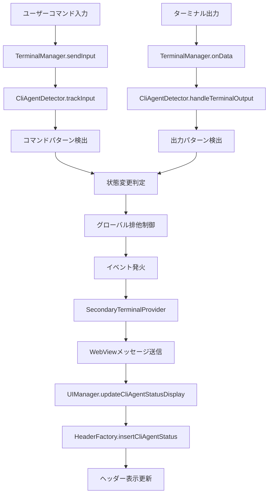

# CLI Agent ステータス機能仕様書

## 概要

この機能は、ターミナル内で実行されるCLI Agent（Claude CLI、Gemini CLI等）の状態を自動検出し、ターミナルヘッダーに視覚的なステータス表示を提供します。また、CMD+OPT+Lショートカットによるデータ送信時に、どのターミナルが送信対象かを視覚的に示すために使用されます。

## 対応CLI Agent

### 現在サポート
- **Claude CLI** (`claude` コマンド)
- **Gemini CLI** (`gemini` コマンド)

### 検出パターン
#### 起動検出
**コマンド検出:**
- `claude` で始まるコマンド
- `gemini` で始まるコマンド

**出力パターン検出:**
- Claude CLI: `welcome to claude code`, `claude.ai`, `anthropic`, `human:`, `assistant:`
- Gemini CLI: `welcome to gemini`, `google ai`, `bard`, `user:`, `model:`

#### 終了検出
**明示的終了パターン:**
- `goodbye`, `chat ended`, `session terminated`, `exiting`, `bye`, `quit`, `exit`

**中断パターン:**
- `^c` (Ctrl+C), `keyboardinterrupt`, `sigint`, `interrupted`, `cancelled`

**プロンプト復帰パターン:**
- Shell prompt: `$`, `%`, `>`, `➜`, `[user@host dir]$`
- 正規表現による複数行解析


## ステータス表示

### 表示状態
1. **Connected (アクティブ)**: CLI Agentが実行中
2. **Disconnected (非アクティブ)**: CLI Agentが終了済み
3. **None**: CLI Agentが検出されていない

### 表示形式
```
[Terminal Icon] Terminal Name [CLI AGENT STATUS] [Split] [×]
```

**例:**
```
⚡ Terminal 1 CLAUDE CLI Connected ⊞ ✕
⚡ Terminal 2 GEMINI CLI Disconnected ⊞ ✕
⚡ Terminal 3 ⊞ ✕
```

### 表示ルール
- ステータスは `.terminal-status` セクションに表示
- アクティブ時: `CLAUDE CLI Connected` / `GEMINI CLI Connected`
- 非アクティブ時: `CLAUDE CLI Disconnected` / `GEMINI CLI Disconnected`
- 検出なし時: ステータス表示なし

## 相互排他制御

### 基本原則
**グローバル単一アクティブ**: 全システムで同時にアクティブになれるCLI Agentは1つのみ

### 動作例
1. ターミナル1で `claude cli` 起動 → ターミナル1がActive
2. ターミナル2で `claude cli` 起動 → ターミナル2がActive、ターミナル1がInactive
3. ターミナル3で `gemini cli` 起動 → ターミナル3がActive、ターミナル2がInactive

### 切り替えロジック
```typescript
// 新しいCLI Agent起動時
if (existingGlobalAgent && existingGlobalAgent.terminalId !== newTerminalId) {
  deactivate(existingGlobalAgent.terminalId);
}
activate(newTerminalId, agentType);
```

## アーキテクチャ

### 主要コンポーネント

#### 1. SecondaryCliAgentDetector
**役割**: CLI Agentの検出・状態管理
**場所**: `src/integration/SecondaryCliAgentDetector.ts`

**主要機能:**
- 入力コマンド監視 (`trackInput`)
- 出力パターン監視 (`handleTerminalOutput`)
- 状態変更イベント発火 (`onCliAgentStatusChange`)
- グローバル排他制御

**状態管理:**
```typescript
private _cliAgentsInfo = new Map<string, CliAgentInfo>(); // terminalId -> 詳細情報
private _globalActiveAgent: { terminalId: string; type: CliAgentType } | null; // グローバルアクティブ
```

#### 2. TerminalManager
**役割**: CLI Agent検出器との統合
**場所**: `src/terminals/TerminalManager.ts`

**統合ポイント:**
- 入力送信時: `this._cliAgentDetector.trackInput()`
- 出力受信時: `this._cliAgentDetector.handleTerminalOutput()`
- イベント公開: `public get onCliAgentStatusChange()`

#### 3. SecondaryTerminalProvider  
**役割**: Extension ↔ WebView間通信
**場所**: `src/providers/SecondaryTerminalProvider.ts`

**メッセージフロー:**
```
CliAgentDetector → TerminalManager → SecondaryTerminalProvider → WebView
```

**送信メッセージ:**
```typescript
{
  command: 'cliAgentStatusUpdate',
  cliAgentStatus: {
    activeTerminalName: string | null,
    status: 'connected' | 'disconnected' | 'none',
    agentType: 'claude' | 'gemini' | null
  }
}
```

#### 4. WebView (UIManager + HeaderFactory)
**役割**: ステータス表示の実装
**場所**: 
- `src/webview/managers/UIManager.ts`
- `src/webview/factories/HeaderFactory.ts`

**表示フロー:**
```
MessageManager → TerminalWebviewManager → UIManager → HeaderFactory
```

### データフロー



## 設定とカスタマイズ

### CMD+OPT+L データ送信機能
このステータス表示機能は、CMD+OPT+Lショートカットによるデータ送信の視覚的指標として機能します：
- CLI Agentがアクティブな場合、そのターミナルがデータ送信対象
- ユーザーは視覚的にどのターミナルにデータが送信されるかを確認可能

### バッファサイズ
```typescript
private readonly MAX_HISTORY_SIZE = 100; // コマンド履歴
private readonly PROMPT_BUFFER_SIZE = 10; // プロンプト検知用
```

### 検出パターンの追加
新しいCLI Agentを追加する場合:

1. **型定義の追加**:
```typescript
// src/integration/SecondaryCliAgentDetector.ts
export type CliAgentType = 'claude' | 'gemini' | 'newagent';
```

2. **検出パターンの追加**:
```typescript
private _detectAgentFromCommand(command: string): CliAgentType | null {
  if (command.startsWith('newagent')) return 'newagent';
  // ...
}

private _detectAgentFromOutput(data: string): CliAgentType | null {
  const newAgentPatterns = ['welcome to newagent', 'newagent ready'];
  // ...
}
```

3. **表示名の設定**:
```typescript
// src/webview/factories/HeaderFactory.ts
const agentDisplayName = agentType === 'newagent' ? 'NEW AGENT CLI' : existingLogic;
```

## テストとデバッグ

### ログ出力
**有効化**: 開発者ツールコンソールで確認

**主要ログポイント:**
- `📥 [CLI-AGENTS-DETECTOR]`: 出力検出
- `✅ [CLI-AGENTS-DETECTOR]`: アクティベーション
- `❌ [CLI-AGENTS-DETECTOR]`: デアクティベーション
- `🔄 [CLI-AGENTS-DETECTOR]`: 排他制御
- `📊 [CLI-AGENTS-DETECTOR]`: グローバル状態

### 手動テスト
```bash
# ターミナル1
claude

# ターミナル2  
claude
# → ターミナル1のステータスがinactiveに変化することを確認

# ターミナル3
gemini  
# → ターミナル2のステータスがinactiveに変化することを確認
```

### デバッグAPI
```typescript
// Extension側
terminalManager._cliAgentDetector.getCurrentGloballyActiveAgent()
terminalManager._cliAgentDetector.getActiveAgents()
terminalManager._cliAgentDetector.isGloballyActive(terminalId)
```

## 制限事項

### 現在の制限
1. **検出精度**: 出力パターンベースのため、完全ではない
2. **遅延**: 出力バッファリングにより検出に若干の遅延
3. **カスタムプロンプト**: 特殊なシェルプロンプトは検出できない場合がある

### 既知の問題
1. **高頻度出力**: 大量出力時にパフォーマンス影響の可能性
2. **複数セッション**: 同一ターミナル内での複数セッション切り替えは未サポート

## パフォーマンス考慮

### 最適化事項
- **バッファリング**: 出力データのバッチ処理
- **デバウンシング**: 状態更新の過度な頻度を制御
- **キャッシュ**: ヘッダー要素のキャッシュ機能

### メモリ管理
- **自動クリーンアップ**: ターミナル削除時の状態クリア
- **循環参照回避**: イベントリスナーの適切な破棄

## 将来の拡張

### 検討中の機能
1. **設定UI**: 検出パターンのカスタマイズ
2. **ステータス詳細**: 実行時間、コマンド履歴の表示
3. **通知機能**: CLI Agent状態変更の通知
4. **マルチエージェント**: 複数CLI Agentの同時実行サポート

### API拡張ポイント
```typescript
interface ExtendedCliAgentInfo {
  type: CliAgentType;
  isActive: boolean;
  startTime: Date;
  lastActivity: Date;
  sessionDuration?: number;
  commandCount?: number;
  lastCommand?: string;
}
```